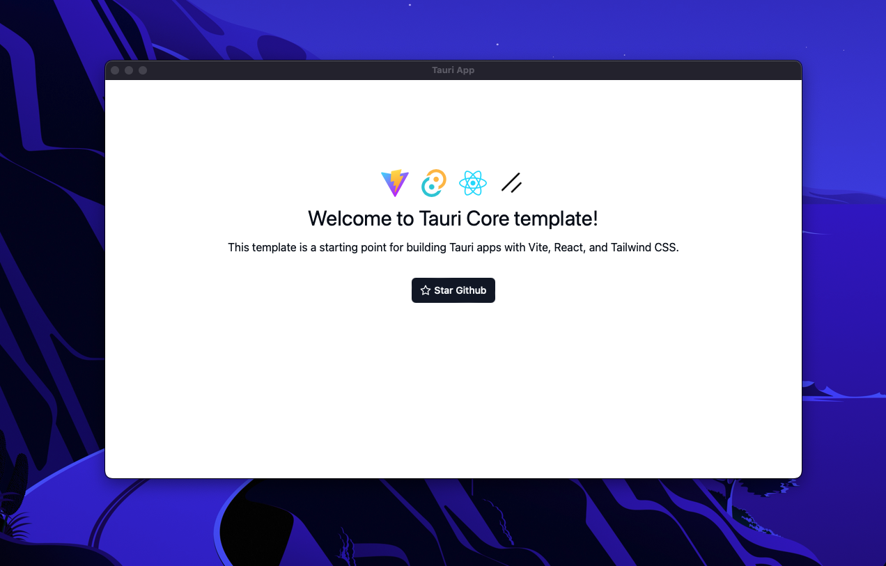

# OpenNote

Privacy-first, on-device audio transcription — powered by local AI models running entirely on your machine.

OpenNote is an Apple Silicon desktop app that records audio from your microphone or system audio and transcribes it locally after you stop recording. No cloud APIs, no audio leaving your device. Everything stays on your machine.

Built with [Tauri v2](https://v2.tauri.app/) (Rust backend), [React 19](https://react.dev/), [TypeScript](https://typescriptlang.org/), [Tailwind CSS v4](https://tailwindcss.com/), and [shadcn/ui](https://ui.shadcn.com/).



## Features

- **Local transcription** — Audio is transcribed by Whisper running directly on your Apple Silicon Mac. No server round-trips.
- **Microphone & system audio** — Record from your microphone or capture computer audio (macOS 13+ with Screen Recording permission).
- **Model management** — Download, switch, and delete transcription models from an in-app settings panel. Models are stored locally.
- **Transcript editing** — View, search, and edit individual transcript lines. Rename recordings, mark partial transcriptions.
- **Audio playback & export** — Replay recordings, export transcripts, and manage audio files.
- **SQLite storage** — All recordings and transcripts are persisted in a local SQLite database with automatic migrations.
- **Custom title bar** — Native-feeling overlay title bar for a clean, minimal UI.

## Tech Stack

| Layer | Technology |
|-------|-----------|
| Desktop runtime | [Tauri v2](https://v2.tauri.app/) (Rust) |
| Frontend | React 19, TypeScript, Vite |
| Styling | Tailwind CSS v4, shadcn/ui (new-york style) |
| State | Zustand |
| Routing | react-router v7 |
| Database | SQLite via `tauri-plugin-sql` |
| Transcription | `transcribe-rs`, embedded `whisper.cpp`, Metal, Core ML |
| Audio | `cpal`, `hound` (WAV capture & encoding) |
| Validation | Zod |
| Linting | Biome via ultracite, Husky + lint-staged |

## Getting Started

### Prerequisites

- [Tauri v2 prerequisites](https://v2.tauri.app/start/prerequisites/) (Rust toolchain, platform SDKs)
- [Bun](https://bun.sh) (or npm/pnpm/yarn)
- Apple Silicon Mac (system audio recording requires macOS 13+)

### Install

```bash
git clone https://github.com/caleblee/opennote-rs.git
cd opennote-rs
bun install
```

### Development

```bash
# Start the Tauri dev environment (Rust + frontend hot reload)
bun run tauri dev
```

The frontend dev server runs on `http://localhost:1420`.

### Production Build

```bash
bun run tauri build
```

## Project Structure

```
opennote-rs/
├── src/                          # Frontend (React + TypeScript)
│   ├── app/                      # App shell — providers, router, routes
│   ├── components/ui/            # shadcn/ui primitives
│   ├── config/                   # Zod-validated env vars
│   ├── features/
│   │   ├── recording/           # Live recording UI, waveform, dialog
│   │   ├── transcription/       # Transcription service, model types
│   │   ├── library/             # Recording list, sidebar, detail view
│   │   ├── settings/            # Model management, download progress
│   │   ├── errors/              # Error boundary pages
│   │   └── built-with/          # Tech stack showcase
│   ├── stores/                   # Zustand stores (recordings)
│   ├── types/                    # Shared TypeScript types
│   ├── hooks/                    # Shared custom hooks
│   ├── lib/                      # Utilities (cn, env helpers)
│   └── main.tsx                  # Entry point
├── src-tauri/                    # Rust backend (Tauri v2)
│   ├── src/
│   │   ├── main.rs              # App entry, DB migrations, command registration
│   │   └── transcription/       # Audio capture, model loading, transcription
│   │       ├── mod.rs            # Tauri commands, state, permissions
│   │       ├── audio.rs          # Microphone & system audio capture (cpal)
│   │       ├── worker.rs         # Transcription worker thread
│   │       ├── whisper.rs        # Embedded Whisper model integration
│   │       └── models.rs         # Model download & management
│   ├── Cargo.toml
│   └── tauri.conf.json
└── package.json
```

## Architecture

The app follows [bulletproof-react](https://github.com/alan2207/bulletproof-react) conventions — feature-based modules with colocated components, hooks, API services, types, and stores.

**Data flow:**

1. **Recording** — The Rust backend captures audio via `cpal`, writes WAV files, and streams audio-level events to the frontend.
2. **Transcription** — A background worker loads a downloaded Whisper model and transcribes the completed WAV locally. Metal and Core ML acceleration are enabled on Apple Silicon. The first Core ML inference may take longer while macOS compiles the encoder.
3. **Storage** — Recordings and transcript lines are persisted in SQLite via `tauri-plugin-sql` with automatic schema migrations.
4. **State** — The frontend uses Zustand stores that wrap the SQL repository, keeping the UI in sync with the database.

## Commands

| Command | Description |
|---------|-------------|
| `bun run dev` | Start Vite dev server (frontend only) |
| `bun run tauri dev` | Start Tauri dev (Rust + frontend) |
| `bun run build` | TypeScript check + Vite build |
| `bun run tauri build` | Production Tauri build |
| `bun run check` | Biome lint/format check |
| `bun run fix` | Biome lint/format auto-fix |
| `bun run typecheck` | TypeScript type check only |

## License

[MIT](./LICENSE)
